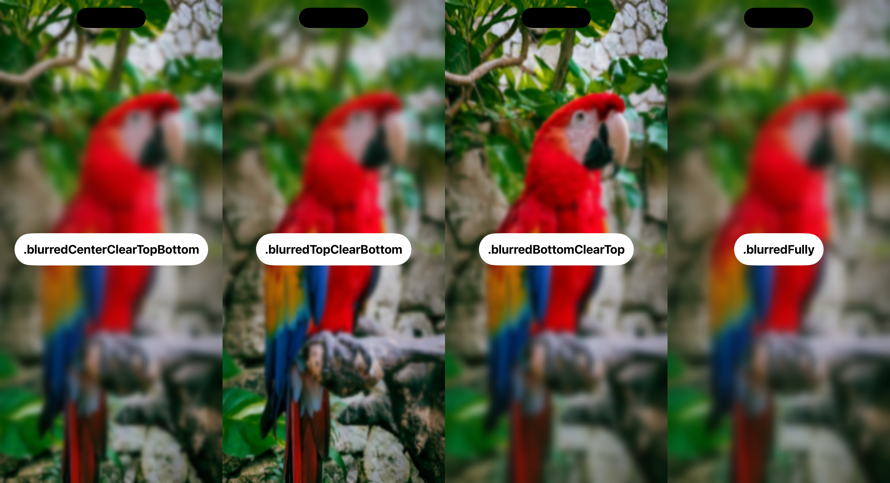

# DMVariableBlurView

A blur whose radius changes from row to row, for SwiftUI and UIKit.

[](https://github.com/nikolay-dementiev/DMVariableBlurView/actions/workflows/ci.yml)
[](#requirements)
[](#requirements)
[](LICENSE)
[](https://app.fossa.com/projects/git%2Bgithub.com%2Fnikolay-dementiev%2FDMVariableBlurView?ref=badge_shield)



> **This package uses a private API of the system.** App Review Guideline 2.5.1 asks that
> apps use only public APIs, and an App Store rejection was reported for the project this
> package derives from. Read [Private API](#private-api) before you ship it.

- [What it is](#what-it-is)
- [Private API](#private-api)
- [Requirements](#requirements)
- [Installation](#installation)
- [Quick start](#quick-start)
- [Usage](#usage)
- [Behaviour your app must know](#behaviour-your-app-must-know)
- [Example app and tests](#example-app-and-tests)
- [Versions and migration](#versions-and-migration)
- [The family](#the-family)
- [Contributing, security, licence](#contributing-security-licence)

## What it is

`DMVariableBlurView` blurs what lies behind it. Unlike the materials of the system, the
blur is not uniform: it is strongest where you ask for it and fades linearly to clear, from
the top, from the bottom, from a band across the middle, or not at all. Use it for a header
that fades into the content under it, or as the backdrop of a message, the way DMUnLoader
uses it behind its HUD.

When not to use it:

- On iOS 26 and later, the system fades the edges of a scroll view with public API:
  `scrollEdgeEffectStyle(_:for:)` in SwiftUI and `UIScrollEdgeEffect` in UIKit. If the edge
  of a scroll view is where you need the effect, and your app runs on iOS 26 or later only,
  use those.
- If your app cannot take the risk of a private API in App Review.

## Private API

The view is a `UIVisualEffectView` whose backdrop draws the content behind it through a list
of filters. The view replaces that list with the system's `variableBlur` filter, which blurs
every row of pixels with its own radius. That filter is not public. The library reaches it
through these names, which it writes out in full and does not disguise. In a release build a
short name may sit in the machine code rather than among the strings of the binary; that does
not hide it from a scan.

| Name | What it is |
|---|---|
| `CAFilter` | the class of the filter |
| `filterWithType:` | the class method that creates a filter |
| `filterTypes` | the class property that lists the filter types the system offers |
| `variableBlur` | the type of the filter |
| `inputRadius`, `inputMaskImage`, `inputNormalizeEdges` | the inputs of the filter |
| `scale` | a key of the backdrop's layer, set to the scale of the screen |

- App Review Guideline 2.5.1 says: "Apps may only use public APIs".
- A user of [VariableBlur](https://github.com/nikstar/VariableBlur), the project this package
  derives from, reported an App Store rejection that named two of these strings
  ([issue 8](https://github.com/nikstar/VariableBlur/issues/8)).
- Before it installs the filter, the view checks that the class exists, that it answers both
  selectors, that the system lists the filter type, that a filter is created, and that the
  effect has a backdrop. After installing it, the view reads the filter back. When a check
  fails, the view shows the plain blur of the system and reports
  `DMVariableBlurError.effectUnavailable`.
- The view also relies on how the effect view is built, which is not documented: the backdrop
  is the first subview whose layer carries filters, and the other subviews, except
  `contentView`, are the tint, which the view hides.
- These checks contain the risk of a system that changed; they cannot remove it. An exception
  raised inside the private code cannot be caught from Swift, so it ends the app.

Whether to ship it is your decision.

## Requirements

- Swift 6.0 or later, which is Xcode 16 or later.
- iOS 17 or later.

What each version is verified with:

| What | How |
|---|---|
| iOS 26.5 (Xcode 26.6), iOS 18.5 (Xcode 16.4) | the tests of the package and of the example app run on simulators in CI; the snapshot tests compare on iOS 26.5 only |
| iOS 17.5 (Xcode 26.6) | the same tests run on a simulator before each release |
| iOS 18.6, iOS 26.5 (Xcode 26.6) | the same tests ran on simulators for 1.1.0 |
| Swift 6.0 (Xcode 16.0) | CI compiles the library with that compiler; no test runs with it |

## Installation

### Swift Package Manager

In Xcode, choose File > Add Package Dependencies and enter
`https://github.com/nikolay-dementiev/DMVariableBlurView`. In a package manifest:

```swift
// swift-tools-version: 6.0
import PackageDescription

let package = Package(
    name: "MyApp",
    platforms: [.iOS(.v17)],
    dependencies: [
        .package(url: "https://github.com/nikolay-dementiev/DMVariableBlurView.git", from: "1.1.0")
    ],
    targets: [
        .target(
            name: "MyApp",
            dependencies: [
                .product(name: "DMVariableBlurView", package: "DMVariableBlurView")
            ]
        )
    ]
)
```

### CocoaPods

```ruby
pod 'DMVariableBlurView', '1.1.0'
```

Version 1.1.0 is the last release published to the CocoaPods trunk, which plans to become
read-only on 2 December 2026. Later releases come through Swift Package Manager only. The
podspec stays in the repository, and CI lints it.

## Quick start

```swift
import DMVariableBlurView
import SwiftUI

struct ArticleView: View {
    var body: some View {
        ZStack(alignment: .top) {
            ScrollView {
                Text("The text of a long article.")
                    .padding()
            }
            DMVariableBlurView(maxBlurRadius: 12, direction: .blurredTopClearBottom)
                .frame(height: 120)
                .ignoresSafeArea(edges: .top)
                .allowsHitTesting(false)
        }
    }
}
```

## Usage

### Directions

| `DMVariableBlurDirection` | Where the blur is strongest |
|---|---|
| `.blurredTopClearBottom` | at the top edge, fading to clear at the bottom edge |
| `.blurredBottomClearTop` | at the bottom edge, fading to clear at the top edge |
| `.blurredCenterClearTopBottom(centerBandProportion:)` | in a band across the middle, fading to clear at the top and bottom edges. The proportion is the height of the band, in `0...1`; 0.3 by default |
| `.blurredFully` | over the whole view |

### Values

| Value | Default | Valid values | Meaning |
|---|---|---|---|
| `maxBlurRadius` | 20 | finite, 0 or greater | the blur radius, in points, where the blur is strongest |
| `direction` | `.blurredCenterClearTopBottom()` | see above | where the blur is strongest and where it fades to clear |
| `startOffset` | 0 | finite | where the fade of the top and bottom modes ends, as a share of the height. A positive value leaves that share clear at the clear edge, and from 1 on nothing is blurred. A negative value keeps some blur at the clear edge. The other modes ignore it |

A value outside its range is not applied: the view shows the plain blur of the system and
reports why, see [Failures](#failures).

### Changing the values

SwiftUI hands new values to the view that is already on the screen:

```swift
import DMVariableBlurView
import SwiftUI

struct AdjustableBlur: View {
    @State private var radius: CGFloat = 8
    @State private var blursTop = true

    var body: some View {
        ZStack {
            Text(String(repeating: "The content under the blur. ", count: 40))
                .padding()
            DMVariableBlurView(
                maxBlurRadius: radius,
                direction: blursTop ? .blurredTopClearBottom : .blurredBottomClearTop
            )
            .allowsHitTesting(false)
            VStack {
                Spacer()
                Slider(value: $radius, in: 0...30)
                Toggle("Blur the top", isOn: $blursTop)
            }
            .padding()
        }
    }
}
```

### UIKit

Content you add to the `contentView` of the view stays visible over the blur. To fade the
view out, a host may set `effect` to `nil`; new values given meanwhile wait for the effect.

```swift
import DMVariableBlurView
import UIKit

final class HeaderViewController: UIViewController {
    private let blur = DMVariableBlurUIView(maxBlurRadius: 12, direction: .blurredTopClearBottom)

    override func viewDidLoad() {
        super.viewDidLoad()
        blur.isUserInteractionEnabled = false
        blur.translatesAutoresizingMaskIntoConstraints = false
        view.addSubview(blur)
        NSLayoutConstraint.activate([
            blur.topAnchor.constraint(equalTo: view.topAnchor),
            blur.leadingAnchor.constraint(equalTo: view.leadingAnchor),
            blur.trailingAnchor.constraint(equalTo: view.trailingAnchor),
            blur.heightAnchor.constraint(equalToConstant: 120)
        ])
    }

    func blurTheBottomInstead() {
        blur.update(maxBlurRadius: 12, direction: .blurredBottomClearTop, startOffset: 0)
        if let failure = blur.failure {
            print("The blur is not shown: \(failure.localizedDescription)")
        }
    }
}
```

### Failures

When a value is not valid, or the system does not offer the filter, the view shows the plain
blur of the system over its whole frame and records the reason as a `DMVariableBlurError`:

| Case | Reason |
|---|---|
| `invalidMaxBlurRadius(_:)` | the radius is negative, infinite or not a number |
| `invalidCenterBandProportion(_:)` | the proportion of the center band is outside `0...1`, or not a number |
| `invalidStartOffset(_:)` | the offset is infinite or not a number |
| `effectUnavailable` | the system does not offer the variable blur, or did not accept it |
| `maskCreationFailed` | the image that shapes the blur could not be created |

In SwiftUI, a handler receives the reason on the main actor, after the update that applied
the values, so it may change state:

```swift
import DMVariableBlurView
import OSLog
import SwiftUI

struct ReportingBlur: View {
    private let logger = Logger(subsystem: "MyApp", category: "blur")

    var body: some View {
        DMVariableBlurView(maxBlurRadius: 12, direction: .blurredTopClearBottom)
            .onFailure { error in
                logger.error("The blur is not shown: \(error.localizedDescription, privacy: .public)")
            }
    }
}
```

The handler runs once for each configuration that fails, and again when a failure returns
after a valid configuration. Without a handler, the view writes one line for each failure to
the unified log, under the subsystem `DMVariableBlurView` and the category `failure`. In
UIKit, the `failure` property holds the reason, and each reason also goes to the log.

`onFailure(_:)` and `respectsReduceTransparency(_:)` are methods of `DMVariableBlurView`:
call them before other modifiers such as `.frame`.

## Behaviour your app must know

### Touches

The blur takes the touches in its frame. In SwiftUI, add `.allowsHitTesting(false)` to let
them reach the views underneath: SwiftUI gives a view that wraps a UIKit view the touches in
its frame. In UIKit, set `isUserInteractionEnabled` to `false`.

```swift
import DMVariableBlurView
import SwiftUI

struct TappableUnderBlur: View {
    @State private var taps = 0

    var body: some View {
        ZStack {
            Button("Tapped \(taps) times") { taps += 1 }
            DMVariableBlurView(direction: .blurredFully)
                .allowsHitTesting(false)
        }
    }
}
```

The default stays as it is: the released DMUnLoader 1.0.x relies on the blur taking the
touches on iOS 26.

### Accessibility and Reduce Transparency

No view of the blur is an accessibility element. By default the view ignores the Reduce
Transparency setting and always shows the variable blur, as release 1.0.0 does. A view that
follows the setting shows the standard effect of the system while the setting is on, which
the system then draws without transparency. That is not a failure: nothing is reported.

```swift
import DMVariableBlurView
import SwiftUI

struct AccessibleHeader: View {
    var body: some View {
        DMVariableBlurView(direction: .blurredTopClearBottom)
            .respectsReduceTransparency()
    }
}
```

In UIKit, set `respectsReduceTransparency` to `true`.

### Threads, appearance and cost

- Both views are used on the main thread, as every view is. The failure handler runs on the
  main actor.
- The blur keeps its shape when the appearance changes between light and dark, and when the
  `effect` of the view is assigned: UIKit rebuilds the effect then, and the view puts the
  variable blur back in the same layout pass.
- The view draws the image that shapes the blur once for each configuration, with
  CoreGraphics, at 100 by 100 pixels. The blur itself is drawn by the system.

## Example app and tests

`Examples/DMVariableBlurViewExample` is an app that pages through every direction over a
striped pattern. Open `DMVariableBlurViewExample.xcodeproj` and run it on a simulator.

How the package is tested:

- Package tests: the validation and the shape of the blur, every adapter with hand-written
  spies, the failure reports, and the views through their public API.
- Tests hosted in the example app: they render the blur in a window over a striped scene and
  measure how sharp each of twenty bands is, also after the appearance changes and after the
  direction changes. Snapshot tests compare the picture with references recorded on iOS 17.5,
  18.6 and 26.5.
- UI tests: the app switches to the dark appearance and a screenshot is measured, and a tap
  reaches a button under a blur that lets touches through.
- CI also lints, checks the public interface against a committed baseline, builds a consumer
  package and the documentation, lints the podspec, and fails below a coverage floor.

## Versions and migration

DMVariableBlurView follows semantic versioning. [CHANGELOG.md](CHANGELOG.md) records every
release.

Coming from 1.0.x: no declaration was removed, and the UIKit class is now `final`, which no
code outside the package could notice because it was never `open`. Some behaviour changed,
and the changelog lists each change. The ones most likely to matter:

- the blur keeps its shape after the appearance changes and after `effect` is assigned;
- SwiftUI applies new values to a view that is already on the screen;
- `centerBandProportion: 1` blurs the whole height, and a `startOffset` of 1 or more blurs
  nothing;
- a negative or non-finite radius and a non-finite offset are rejected, and every failure is
  reported instead of dropped.

## The family

DMVariableBlurView is one of three packages that share their conventions:

- [DMAction](https://github.com/nikolay-dementiev/DMAction): composes completion-based actions
  with retries and fallbacks.
- [DMUnLoader](https://github.com/nikolay-dementiev/DMUnLoader): loading, error and success
  states for SwiftUI and UIKit. It uses DMVariableBlurView behind its HUD.

## Contributing, security, licence

- [CONTRIBUTING.md](CONTRIBUTING.md): how to build, test and propose a change.
- [SECURITY.md](SECURITY.md): how to report a vulnerability. Not in a public issue.
- DMVariableBlurView is available under the MIT License. It derives from
  [VariableBlurView](https://github.com/jtrivedi/VariableBlurView) by jtrivedi and
  [VariableBlur](https://github.com/nikstar/VariableBlur) by nikstar, both under the MIT
  License; their notices are in [THIRD_PARTY_NOTICES.md](THIRD_PARTY_NOTICES.md).
- The demo photo is a stock photo under a free licence.

[](https://app.fossa.com/projects/git%2Bgithub.com%2Fnikolay-dementiev%2FDMVariableBlurView?ref=badge_large)
